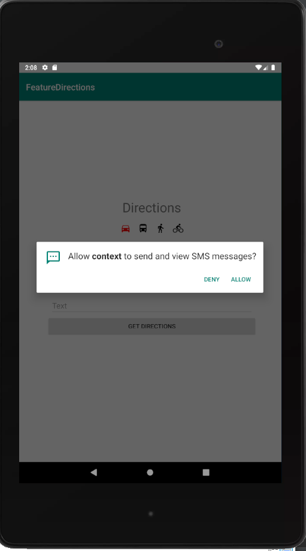
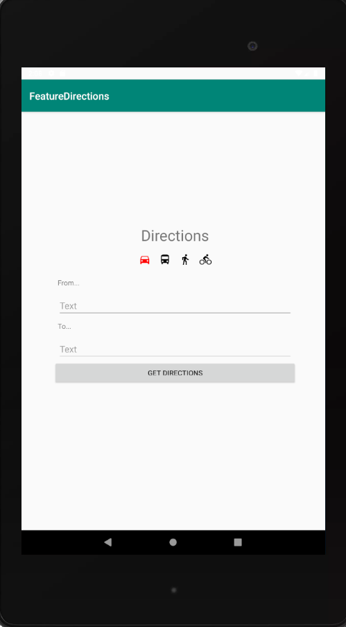
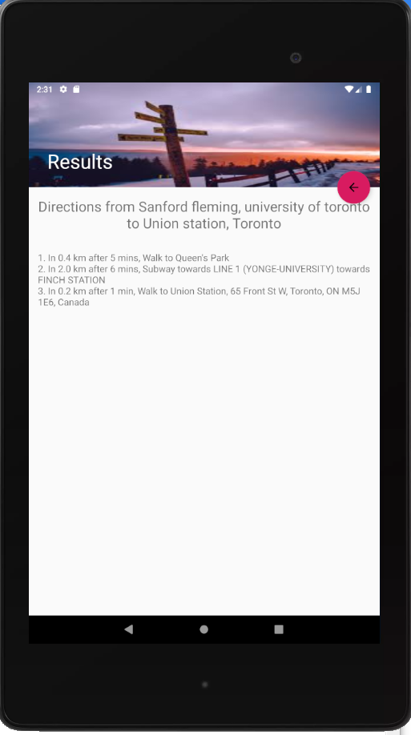
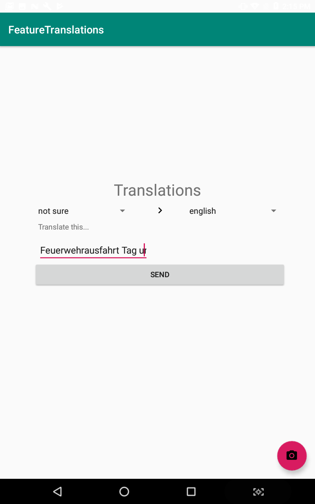
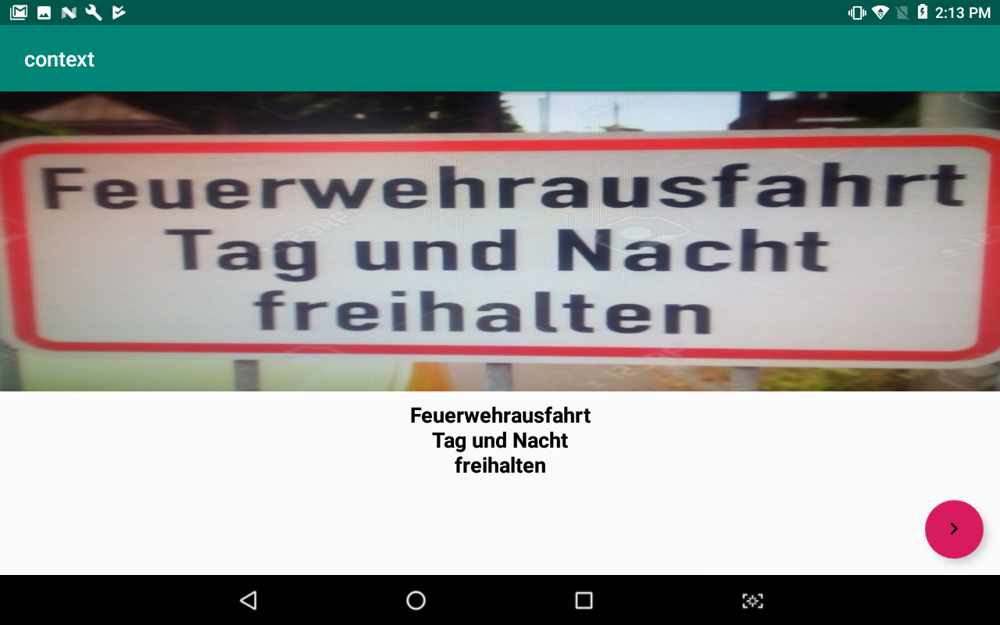
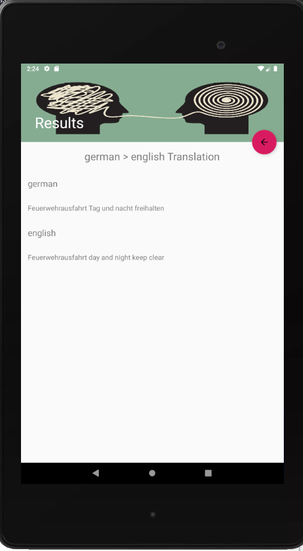

## An android travel app aimed at providing internet-free directions, translations, sports updates, web pages and google search results through text
# Android App
### Features
1. Translations 
    - Provides Translations between any two languages, 
    - automatically detects which language the source is in
    - You can use the OCR feature if the text is unenterable through keyboard
2. Directions
    - Provides step-by-step directions anywhere in the world
    - Provides optimized route between waypoints
    - Distance, time for each step
    - Can choose method of transportation
    - Map view to visualize (COMING SOON)
3. Google Search
    - Any query, 
    - Gives short description of results from top Google results
    - Links of top results from page 1 included (COMING SOON)
    - Enough to get quick answers
4. Sports updates
    - Has capability to get live updates for 10+ most popular sports
    - Capability to get update every x minutes between start and end of game (COMING SOON)
    - Can subscribe to a team (COMING SOON)
5. Best part is, all of this without internet!

### How it works
1. Sends a text message to our server encoded in a special format,
2. This is then parsed and various APIs and web scraping tools are used to gather results,
3. The server sends a text message in the same format before,
4. The results are parsed and displayed

### Screeenshots
Features             |  Asks for texting permissions
:-------------------------:|:-------------------------:
  |  

Enter Directions             |  Directions Result
:-------------------------:|:-------------------------:
  |  

Enter Translations Text             |  OCR |  Translations Result
:-------------------------:|:-------------------------:|:-------------------------:
  |   |  

